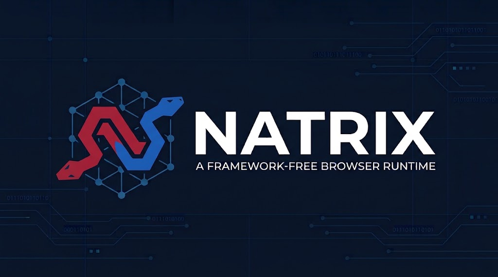

# Natrix

<p align="center">
  <a href="https://natrixapp.netlify.app" target="natrixapp">
    
  </a>
</p>


<p align="center">
  <a href="./README.md"><strong>English</strong></a> |
  <a href="./README.zh-TW.md">繁體中文</a> |
  <a href="./README.zh-CN.md">简体中文</a>
</p>

Natrix is a framework-free browser runtime experiment built around a playable local two-player Snake game.

Compact runtime showcase: command-driven input, fixed-timestep simulation, deterministic replay, explicit lifecycle state, replaceable DOM/Canvas renderers, and live runtime metrics.

No any framework. No game engine. Just browser APIs, JavaScript modules, tests, and a small game surface that makes the runtime behavior easy to inspect.

## Demo

[Play](https://natrixapp.netlify.app)

You can switch the renderer at runtime from the control below the game. The Canvas mode is also addressable through `?renderer=canvas`; missing or invalid renderer values fall back to DOM rendering.

## What This Core Competencies

- **Framework-free browser runtime**: the game runs on plain JavaScript, Webpack, DOM, Canvas, and browser timing APIs.
- **Command-driven input**: keyboard events are translated into logical commands before they reach simulation state.
- **Fixed-timestep simulation**: gameplay advances at a stable logical tick rate instead of depending on display refresh rate.
- **Explicit lifecycle state**: start, pause, resume, finish, and reset are handled by a runtime state machine.
- **Deterministic simulation and replay**: seeded RNG, tick-indexed command logs, replay payloads, and state hashes make gameplay reproducible.
- **Renderer boundary**: `DOMRenderer`, `CanvasRenderer`, and `NullRenderer` share the same `init / render / resize / destroy` contract.
- **Runtime telemetry**: measured simulation and renderer decorators expose rolling FPS, simulation tick rate, and p50/p95 timing without changing deterministic game state.
- **Headless testability**: core simulation and replay logic can run without DOM rendering.
- **Regression coverage**: baseline gameplay, runtime lifecycle, replay, renderer behavior, input buffering, and deterministic fixtures are covered by Jest.

## Gameplay


- Local two-player Snake match with red and blue teams.
- Blue snake uses ⬆️, ⬅️, ⬇️, ➡️.
- Red snake uses `W`, `A`, `S`, `D`.
- Yellow food adds 1 point.
- Green food adds 2 points.
- A snake dies when it collides with the wall or with its own body.
- If every snake on one team dies, the other team wins immediately.
- If time expires, the team with the highest score wins.

## Architecture

```text
KeyboardEvent
    -> KeyboardInput
    -> InputBuffer
    -> GameRuntime
    -> FixedTimestepLoop
    -> Simulation step
    -> Render snapshot
    -> DOMRenderer / CanvasRenderer / NullRenderer
    -> RuntimeMetrics -> PerformancePanel
```

The runtime separates intent, state, and presentation:

- **Input boundary**: browser keyboard events become logical commands.
- **Runtime boundary**: `GameRuntime` owns lifecycle, ticking, command recording, snapshots, and renderer orchestration.
- **Simulation boundary**: `stepGame(state, commands)` advances serializable game state and emits domain events.
- **Replay boundary**: recorded commands and seeded configuration can be replayed synchronously without browser APIs.
- **Rendering boundary**: renderers receive snapshots rather than mutating authoritative game state.

### Main Source Areas

| Path | Responsibility |
| --- | --- |
| `src/js/input/` | Keyboard mapping, command buffering, and input ownership |
| `src/js/runtime/` | Runtime facade, fixed-timestep loop, and lifecycle state machine |
| `src/js/simulation/` | Movement, scoring, collision, finish rules, and pure state stepping |
| `src/js/state/` | Serializable game state, snapshots, canonical state, and state hashing |
| `src/js/replay/` | Command recording, replay codec, replay runner, and payload validation |
| `src/js/render/` | Renderer contract, DOM renderer, Canvas renderer, HUD, renderer host, and mode selection |
| `src/js/telemetry/` | Runtime timing collection, measured simulation decorator, clock adapter, and metrics panel |
| `test/` | Unit, integration, renderer, replay, and regression coverage |
| `docs/baseline/` | Historical gameplay and performance baseline notes |

## Getting Started

```bash
npm ci
npm start
```

Then open `http://localhost:8080`.

## Commands

| Command | Purpose |
| --- | --- |
| `npm start` | Start the Webpack development server on `http://localhost:8080` |
| `npm run build` | Build the production bundle into `dist/` |
| `npm run preview` | Serve the production build at `http://127.0.0.1:4173` |
| `npm test` | Run the Jest test suite |
| `npm run test-coverage` | Generate the coverage report |
| `npm run verify:dev-server` | Smoke-check the development server |
| `npm run verify:preview` | Smoke-check the production preview after a build |

## Verification Baseline

Use this sequence before publishing or reviewing a runtime change:

```bash
npm ci
npm test
npm run test-coverage
npm run build
npm run preview
```

In another terminal, after `npm run preview` is running:

```bash
npm run verify:preview
```

## Design Notes

This codebase uses patterns only where they describe real boundaries:

- **Command** for input, replay, and future transport boundaries.
- **State Machine** for runtime lifecycle rules.
- **Facade** for the public `GameRuntime` API.
- **Strategy** for renderer selection.
- **Adapter** around browser-specific input and rendering concerns.
- **Decorator** for simulation and renderer timing without adding measurement code to their core implementations.
- **Memento-style replay payloads** for reproducible simulation.

## Runtime Metrics

`GameRuntime.getMetrics()` returns a metrics snapshot. The live panel reports FPS, simulation tick rate, frame time p50/p95, simulation step p50/p95, render time p50/p95, input-to-step delay p50/p95, delayed frames, and currently rendered entities. Input timestamps stay in the input buffer metadata, so commands and replay payloads remain deterministic.

Timing percentiles and rates use the latest 300 samples. A frame taking more than 50 ms is counted as delayed, and the live snapshot is published every 250 ms by default. Clock, metrics, or panel failures skip telemetry work instead of stopping gameplay. These values are local observations, not published benchmark claims.

## License

MIT
